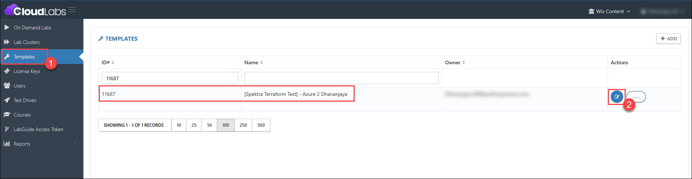
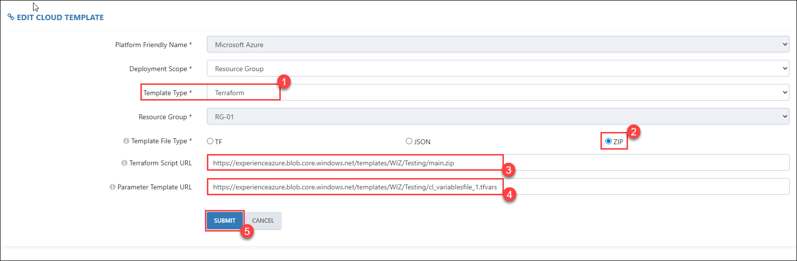
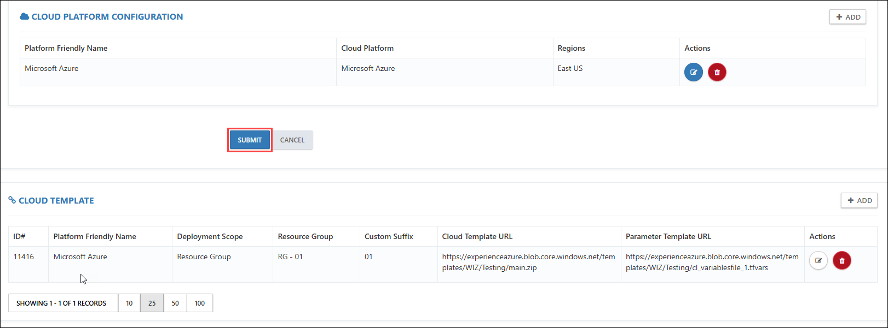
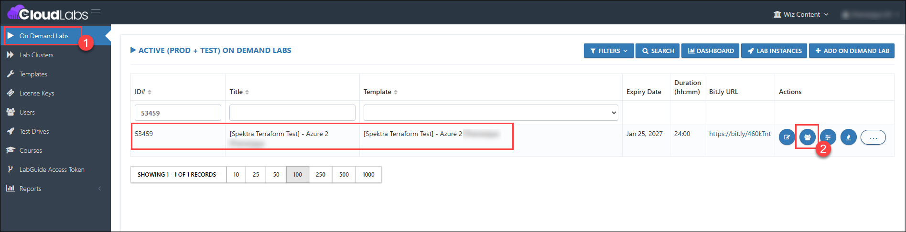

## 45. Terraform support for Nested files. 

### Feature Requirement

Terraform support for Nested files. 

### Implementation

In the cloudlabs template, a Zip file of nested Terraform files can be provided.

### Steps to Test the Terraform support for Nested files. 

### Prerequisites

Some prerequisites need to be followed for all the clouds (Azure, AWS, and GCP) before deploying the Nested Terraform files

#### 1. Prerequisites (Azure) 

Pre-requisites for Deploying Azure Terraform Files in CloudLabs
      
- **Required .tf Files**  
   Make sure you have the following four Terraform files:  
   version.tf  
   main.tf  
   variables.tf  
   outputs.tf  
      
   **Steps:**  
   Compress all four files into a .zip folder.  
   Upload the .zip file to a Storage account.  
   Copy the public URL and paste it into the Cloud Template URL field in CloudLabs.  
      
- **Mandatory Variables in variables.tf**  
    Your variables.tf file must include the following mandatory variables:  
    azure_client_id  
    azure_client_secret  
    azure_subscription_id  
    azure_tenant_id  
    location  
      
- **Create a seperate .tfvars File**  
   Please create a .tfvars file and define values for all variables declared in your variables.tf file, including both the mandatory variables listed earlier and any additional variables required according to your deployment.  

   Example:  
   azure_client_id       = "GET-SUBSCRIPTION-CLIENT-ID"  
   azure_client_secret   = "GET-SUBSCRIPTION-CLIENT-SECRET"  
   azure_subscription_id = "GET-SUBSCRIPTION-GUID"  
   azure_tenant_id       = "GET-TENANT-GUID"  
   location              = "eastus"  
      
   Common or Optional Variable   
   DID = "GET-DEPLOYMENT-ID"  
   
      
   >**Note 1:**  
   All mandatory variables must be present in both variables.tf file and the .tfvars file.  
   Any variable without a default value in variables.tf must be provided in the .tfvars file.  
   Even if a variable has a default value in variables.tf, you can still override it in the .tfvars.  
      
   >**Note 2:**   
   If multiple regions are selected in CloudLabs and one region already has a running deployment, new deployments will automatically shift to another available region.  
   **Important:** Terraform always deploys to the region specified in the .tfvars file.  
   To avoid conflicts or inconsistencies, make sure the region in .tfvars matches one of the selected regions in CloudLabs.   
   For Example, If .tfvars specifies location = "us-central1"  
   Then select us-central1 in CloudLabs as well.  

   **Below are sample nested Terraform files for Azure:**  
   **Cloud Template URL:**   
   https://experienceazure.blob.core.windows.net/templates/WIZ/Testing/main.zip  

   **Parameter Template URL:**   
   https://experienceazure.blob.core.windows.net/templates/WIZ/Testing/cl_variablesfile_1.tfvars  
 
#### 2. Prerequisites (AWS) 

Pre-requisites for Deploying AWS Terraform Files in CloudLabs
      
- **Required .tf Files**  
   Make sure you have the following four Terraform files:  
   version.tf  
   main.tf  
   variables.tf  
   outputs.tf  
      
   **Steps:**  
   Compress all four files into a .zip folder.  
   Upload the .zip file to a Storage account.  
   Copy the public URL and paste it into the Cloud Template URL field in CloudLabs.  
      
- **Mandatory Variables in variables.tf**  
    Your variables.tf file must include the following mandatory variables:  
    aws_access_key  
    aws_secret_key  
    aws_region  
       
- **Create a seperate .tfvars File**  
   Please create a .tfvars file and define values for all variables declared in your variables.tf file, including both the mandatory variables listed earlier and any additional variables required according to your deployment.  

   **Example:**  
   aws_access_key = "GET-SUBSCRIPTION-CLIENT-ID"   
   aws_secret_key = "GET-SUBSCRIPTION-CLIENT-SECRET"   
   aws_region = "us-east-1"
      
   Common or Optional Variable  
   DID = "GET-DEPLOYMENT-ID"  
   
      
   >**Note 1:**  
   All mandatory variables must be present in both variables.tf file and the .tfvars file.  
   Any variable without a default value in variables.tf must be provided in the .tfvars file.  
   Even if a variable has a default value in variables.tf, you can still override it in the .tfvars.  
      
   >**Note 2:**   
   If multiple regions are selected in CloudLabs and one region already has a running deployment, new deployments will automatically shift to another available region.  
   Important: Terraform always deploys to the region specified in the .tfvars file.  
   To avoid conflicts or inconsistencies, make sure the region in .tfvars matches one of the selected regions in CloudLabs.   
   For Example, If .tfvars specifies location = "us-east-1"  
   Then select us-central1 in CloudLabs as well.  
       
   **Allowed Regions (AWS) in CloudLabs:**  
   us-east-1  
   us-west-2  
   us-east-2  
   eu-central-1  
   eu-west-1  
   ap-southeast-1  
   ap-southeast-2  

   **Below are sample nested Terraform files for AWS:**  
   **Cloud Template URL:**   
   https://cloudlabs-prod-templates-s3.s3.us-east-1.amazonaws.com/WIZ/test/AWSTerraform/main.zip  

   **Parameter Template URL:**   
   https://cloudlabs-prod-templates-s3.s3.us-east-1.amazonaws.com/WIZ/test/AWSTerraform/wiz_variables_1.tfvars  

#### 3. Prerequisites (GCP) 

Pre-requisites for Deploying GCP Terraform Files in CloudLabs
      
- **Required .tf Files**  
   Make sure you have the following four Terraform files:  
   version.tf  
   main.tf  
   variables.tf  
   outputs.tf  
      
   **Steps:**  
   Compress all four files into a .zip folder.  
   Upload the .zip file to a Storage account.  
   Copy the public URL and paste it into the Cloud Template URL field in CloudLabs.  
      
- **Mandatory Variables in variables.tf**  
    Your variables.tf file must include the following mandatory variables:  
    credentials_file 
    project_id 
    region 
       
- **Create a seperate .tfvars File**  
   Please create a .tfvars file and define values for all variables declared in your variables.tf file, including both the mandatory variables listed earlier and any additional variables required according to your deployment.  

   **Example:**  
   credentials_file = "key.json"   
   project_id          = "GET-SUBSCRIPTION-FRIENDLY-NAME"   
   region                 = "us-central1"   
      
   Common or Optional Variable  
   DID = "GET-DEPLOYMENT-ID"  
   
   >**Note 1:**  
   For zonal resources, you must specify the zone value in both variables.tf file (e.g., variable "zone" {}) and the .tfvars file.   
      
   >**Note 2:**  
   All mandatory variables must be present in both variables.tf file and the .tfvars file.  
   Any variable without a default value in variables.tf must be provided in the .tfvars file.  
   Even if a variable has a default value in variables.tf, you can still override it in the .tfvars.  
      
   >**Note 3:**   
   If multiple regions are selected in CloudLabs and one region already has a running deployment, new deployments will automatically shift to another available region.  
   Important: Terraform always deploys to the region specified in the .tfvars file.  
   To avoid conflicts or inconsistencies, make sure the region in .tfvars matches one of the selected regions in CloudLabs.   
   For Example, If .tfvars specifies location = "us-central1"  
   Then select us-central1 in CloudLabs as well.  
       
   **Allowed Regions (GCP) in CloudLabs:**  
   us-east4  
   us-west1   
   australia-southeast1   
   europe-west1   
   me-west1   
   asia-northeast1   
   us-central1   

   **Below are sample nested Terraform files for AWS:**  
   **Cloud Template URL:**   
   https://cloudlabs-prod-templates-s3.s3.us-east-1.amazonaws.com/WIZ/test/GCPTerraform/Prod3.zip  

   **Parameter Template URL:**   
   https://cloudlabs-prod-templates-s3.s3.us-east-1.amazonaws.com/WIZ/test/GCPTerraform/var_file_3.tfvars  

1. Log in to the CL portal and navigate to the required tenant (WIZ). On the left-hand side of the page, you will see the Template section.

2. Navigate to the **Template (1)** section in the left menu and go to your respective Template. Click the **Edit (2)** button.

   

3. In the template, scroll down to the **Cloud Template** section. Then, either edit an existing template or click **Add** if it’s a new template.

4. Under the Cloud Template section, ensure that Template Type is set to **Terraform (1)** from the dropdown. Then, select Template File Type as **ZIP (2)**.

5. Then provide the following:  
   **Terraform Script URL – Paste the URL of the .zip file containing all your Terraform files. (3)**  
   **Parameter Template URL – Paste the URL of the .tfvars file. (4)**  

6. Click the **Submit (5)** button. 

   

7. Finally, click the **Submit** button for the entire template.

   

8. Navigate to the **ODL (1)** section in the left menu and go to your respective ODL. Click the **Users (2)** button and deploy the user.

   

